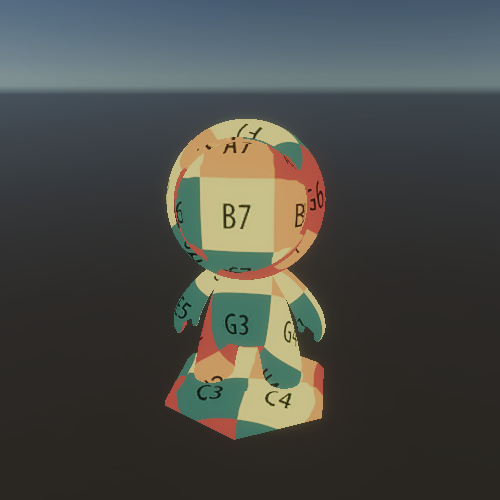
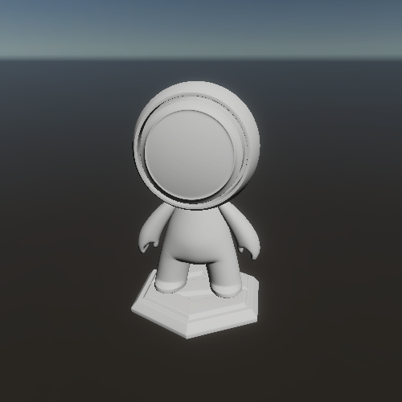

# Unity-Shader-Custom-HDRP
---

 ZKX‘S 自定义 HDRP Shader

---

## 准备工作

### 写作目的

收集整理成为 HDRP 标准 Shader 库

### 写作约束

1. 尽量少的引用 HDRP 标准函数库，只引用几个工具方法代码库。这样可以去掉 HDRP 中的无用变体，方便阅读，提升性能。

   当前的 HDRP Shader 库引用如下

   ```c
   #include "Packages/com.unity.render-pipelines.core/ShaderLibrary/Common.hlsl"
   #include "Packages/com.unity.render-pipelines.high-definition/Runtime/ShaderLibrary/ShaderVariables.hlsl"
   ```

2. 依照 HDRP Shader 中的变量命名，函数调用方式来进行 Shader 代码编写。保持为最新最标准的统一 HDRP Shader 编写规范。

### 参考

- 感谢 B 站 [@Samlee2021](https://space.bilibili.com/291230921) 的 URP_Shader 技术支持
- B 站 [庄懂技术美术入门](https://space.bilibili.com/6373917)
- [HDRP 源码阅读](https://github.com/Unity-Technologies/Graphics/tree/master/com.unity.render-pipelines.high-definition)

## 效果展示

#### 1. Unlit



#### 2. Lambert


