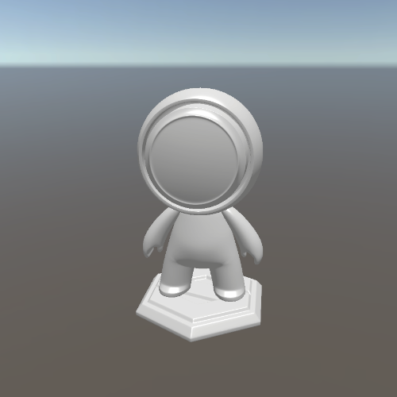

# Unity-Shader-Custom-HDRP

---

自定义 HDRP 效果

---

## 准备工作

### 写作目的

HDRP 效果练习

### 写作约束

1. 适当的引用 HDRP 标准函数库，只引用几个工具方法代码库。这样可以去掉 HDRP 中的无用变体，方便阅读，提升性能。

   当前的 HDRP Shader 库引用如下

   ```c
   #include "Packages/com.unity.render-pipelines.core/ShaderLibrary/Common.hlsl"
   #include "Packages/com.unity.render-pipelines.high-definition/Runtime/ShaderLibrary/ShaderVariables.hlsl"
   #include "Packages/com.unity.render-pipelines.high-definition/Runtime/Lighting/LightDefinition.cs.hlsl"
   ```

2. 依照 HDRP Shader 中的变量命名，函数调用方式来进行 Shader 代码编写。保持为最新最标准的统一 HDRP Shader 编写规范。

### 参考

- B 站 [庄懂技术美术入门](https://space.bilibili.com/6373917)
- [HDRP 源码阅读](https://github.com/Unity-Technologies/Graphics/tree/master/com.unity.render-pipelines.high-definition)
- [HDRP-Custom-Passes](https://github.com/alelievr/HDRP-Custom-Passes)

## 效果展示

### 物体渲染

#### 1. Unlit

##### 无光


#### 2. SimpleLit

##### 简单光照

- 通过材质面板属性可以调整漫反射和高光反射模型，可以自由组合
  - 漫反射模型
    - Lambert
    - HalfLambert
  - 高光反射模型
    - None 
    - Phone
    - BlingPhone
- 使用伪 BRDF 进行光照模型的混合



#### 3. OldSchoolPro


### 全屏特效

#### 50. Outline (Color Threshold)

- 官方文档代码
- 基于颜色阙值的外描边，只能描边需要描边物体的最外层，而且物体亮度不能接近 0


#### 51. GaussionBlur

- 官方文档代码
- 高斯模糊


#### 52. Foreground Camera

- HDRP-Custom-Passes 代码
- 以一个单独的 Pass ，以单独的视角、fov，渲染特定层的物体


#### 53. Camera Capture


#### 54. SSAO

